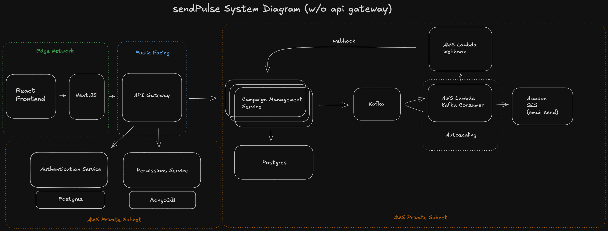

# sendPulse

Put simply, sendPulse is a platform for organizing and sending emails to users in bulk.
I started this project for fun after I got turned out for a job at Postscript that I was really excited about.
I figured if I could build something similar in a weekend, maybe they'd be impressed and hire me the next time around.

Anyway, there is a smorgosborg of technologies and frameworks that I've used to build this project.  

- [Gleam](https://gleam.run/) for the authentication and permissions service
- [Go](https://go.dev/) for the business logic service
- [NextJS](https://nextjs.org/) for the frontend
- [React](https://reactjs.org/) for the frontend
- [EffectTS](https://effect.ts/) for the business logic service
- [MongoDB](https://www.mongodb.com/) for the permissionsdatabase
- [PostgreSQL](https://www.postgresql.org/) for the database
- [Redis](https://redis.io/) for the cache
- [Prometheus](https://prometheus.io/) for the monitoring
- [Grafana](https://grafana.com/) for the monitoring dashboard
- [Kubernetes](https://kubernetes.io/) for the container orchestration

I've also used a lot of other technologies and frameworks to build this project.
- [Terraform](https://www.terraform.io/) for the infrastructure as code
- [Docker](https://www.docker.com/) for the containerization
- [Kubernetes](https://kubernetes.io/) for the container orchestration
- [GitHub Actions](https://github.com/features/actions) for the CI/CD pipeline

Here is a diagram of the project:

There are a lot of things that I would change about this project if I were to do it again or continue working on it and I think there's a lot of great conversations to be had there.

